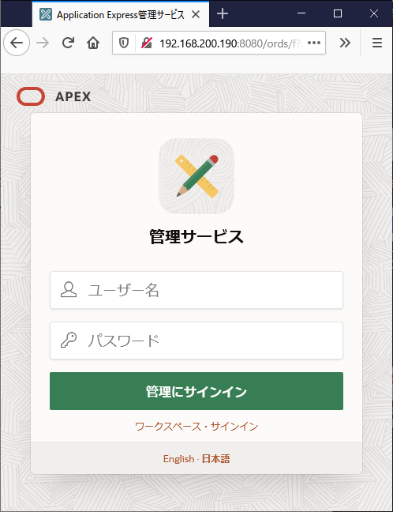
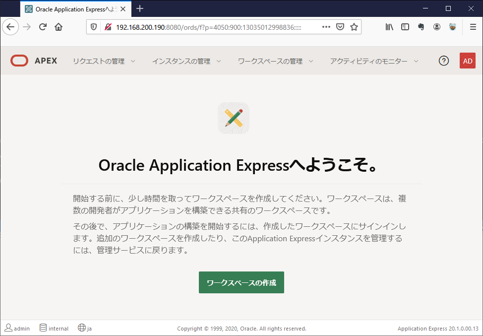
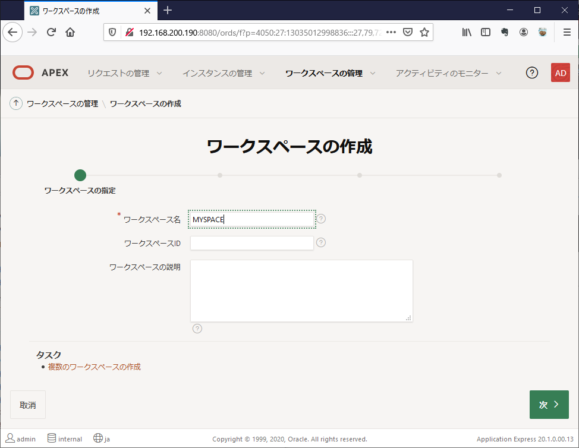
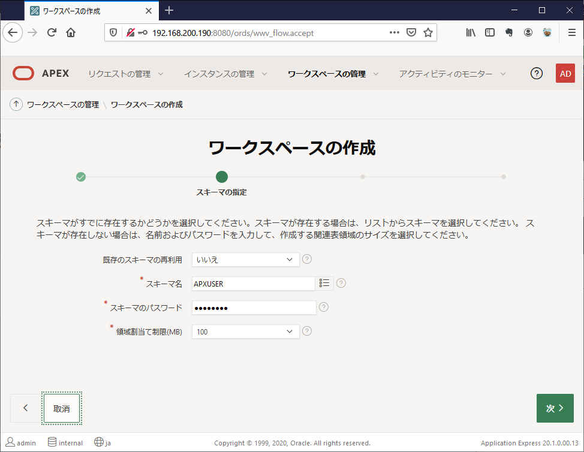
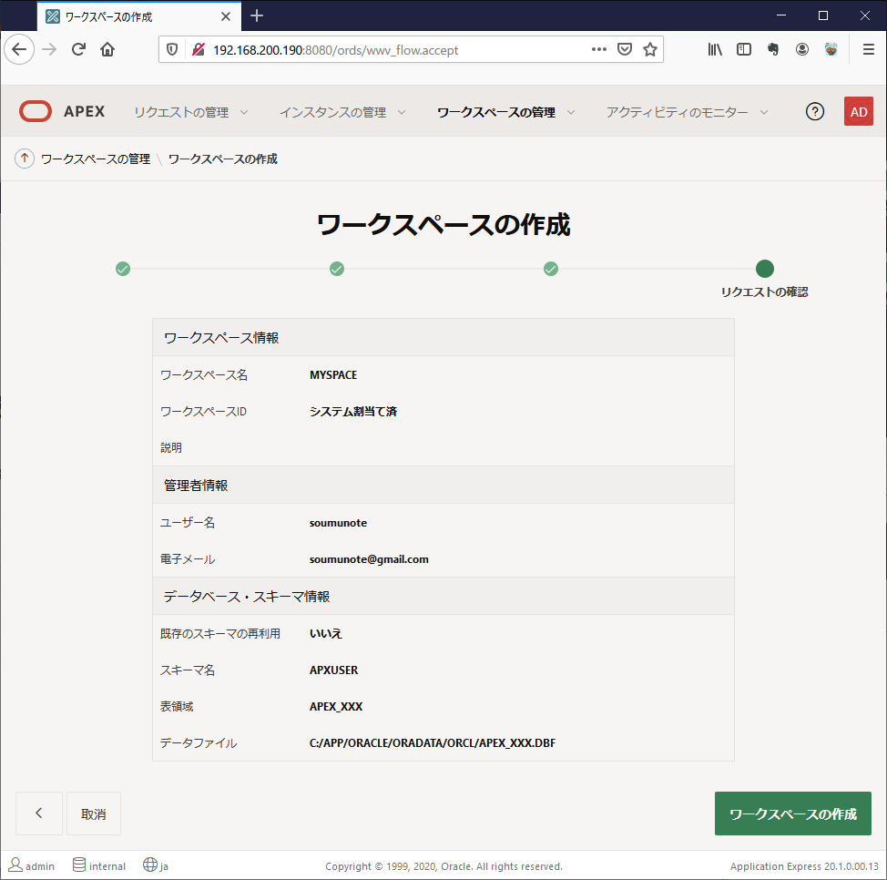

# Oracle Application Express 初期設定

### 1.初回ログインとワークスペースの作成

`http://(IPアドレス):8080/ords/apex_admin`

ユーザ名:ADMIN
パスワード:<パスワード(#付き)>

### ワークスペースの作成
初回ログイン後は、ウィザードになる

0. ワークスペースの作成  

1. ワークスペースの指定  
   
2. スキーマの指定  
   
3. 管理者の指定  
   
4. リクエストの確認
   
